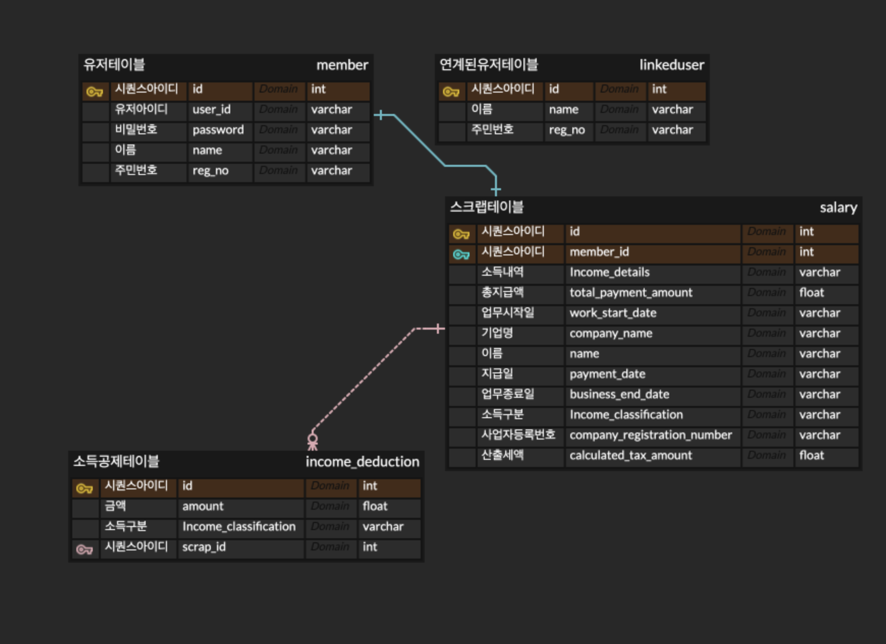

# JAVA 백엔드 엔지니어 과제

### Swagger 주소
>http://localhost:8080/swagger-ui/
### h2 database console 주소 및 db info
>http://localhost:8080/h2-console <br/>
> username : sa<br/>
> password : 없음<br/>
> driver class : org.h2.Driver<br/>
> jdbc url : jdbc:h2:~/test<br/>

## 파일 구조

```
├── auth /권한
    └── resolver / anotaion 리졸버ㅤㅤ
├── config / web config 환경 구성
├── filter / web filter 
├── member /유저 관련 패키지
└── util / 각종 uitl  
```

## 1. 요구사항 구현 여부
>(1) 회원가입, 로그인, 내 정보 보기 구현완료<br/>
>(2) 회원정보 스크래핑 구현완료<br/>
>(3) 환급금 계산 구현완료<br/>


## 2. 요구사항 구현 방법
>(1) 회원가입 : 회원가입시 상세정보를 받아 jpa를 통해 database에 저장하여 구현하며, 연계된 유저정보에 해당하는 가입자만 가입시키도록 하였고 중복 회원가입 검증하였습니다.  <br/><br/>
>(2) 로그인 : 로그인시 필요한 정보들을 받고 Jwts 클래스를 사용하여 토큰을 발행하였으며 , 간단한 로그인 시스템을 위해
> Filter 인터페이스를 직접 구현하여 토큰 검증 및 DB에서 사용자정보를 가져와 request에 담는 방식으로 구현하였습니다.<br/>
> 또한 , HandlerMethodArgumentResolver 구현하여 간단한 어노테이션으로도 사용자 정보를 가져올수있도록 개발하였습니다.<br/><br/>
>(3) 사용자정보 : 헤더를 통해 토큰을 전달받으면 filter -> resolver -> @loginUser 어노테이션을 통해 member entity를 받아와서 유저 정보를 출력하도록 구현하였습니다.<br/><br/>
>(4) 가입한 유저의 정보 스크랩 :  토큰 정보에서 유저 정보를 요구한 api에 resttemplate을 이용하여 요청한뒤 h2 database에 저장하도록 구현하였습니다.<br/><br/>
> db에 저장하기위해 Scrap(급여정보,산출세액정보),IncomeDeduction(소득공제) entity를 생성하였습니다.</br>
> 잘못된 api 요청시에 예외처리하였습니다.</br>
>(5) 결정세액과퇴젹염근공제금액 계산 : ##(4) 과정에서 저장된 DB를 통해 계산과정 요구 사항대로 개발하였습니다. 


## 3. 요구사항 검증 결과 
>Swagger api 테스트 와 Controller 단위테스트 , service 통합테스트로 검증하였습니다.</br><br/>
>(1) 회원가입 검증 : 컨트롤러에는 딱히 로직이 없어 mockmvc를 이용하여 호출 테스트만 진행하였습니다.
> 회원가입 서비스검증은 통합테스트로 진행하였고 연계된 유저 및 중복 예외처리 테스트 및 signup 서비스 메소드를 통해 검증 하였습니다.</br><br/>
>(2) 로그인 검증 : 회원가입후 해당 로그인 및 패스워드로 로그인한후 토큰 발행 및 토큰 검증을 통해 기존 회원가입한 아이디와 일치하는지 검증하였습니다.</br><br/>
>(3) 유저정보가져오기 검증 : 회원가입후  member entity로 유저정보 검증</br><br/>
>(4) 가입한 유저의 정보 스크랩 검증 : service scrap 메소드로 db에 저장한 값과 테스트코드에서 resttemplate를 통해 호출된 정보를 비교하여 검증 하였습니다.</br><br/>
>(5) 결정세액퇴직연금공제금액 계산 검증 : db에 scrap하여 저장한 정보를 계산하여 , 실제 계산된 값과 비교하여 검증하였습니다.

## ERD
